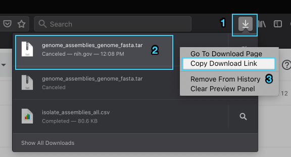

# yoda-usc

Requirements:
1. [Install Docker](https://docs.docker.com/get-docker/)

Usage:
1. `docker run --name yoda-usc -dit bberenberg/yoda-usc bash`
2. `docker exec -it yoda-usc /bin/bash`
2. Download data from https://www.ncbi.nlm.nih.gov/sites/batchentrez and get the URL for the file you need
   * Example for Firefox (2 is a right click): 
    
3. Run this command but replace with the URL from the previous step `wget 'https://www.ncbi.nlm.nih.gov/projects/r_gencoll/ftp_service/nph-gc-ftp-service.cgi/?HistoryId=MCID_600d998359bf921f582c9124&QueryKey=6&ReleaseType=GenBank&FileType=GENOME_FASTA&Flat=true' -O ~/genome-data/genome.tar`
4. `tar -x -f ~/genome-data/genome.tar -C ~/genome-data/`
5. `rm ~/genome-data/genome.tar`
6. `gunzip ~/genome-data/ncbi-genomes-2021-01-24/*.gz`
7. `nohup ~/.local/bin/kaptive.py -v -t 8 -k ~/kaptive/Acinetobacter_baumannii_k_locus_primary_reference.gbk -a ~/genome-data/ncbi-genomes-2021-01-24/*.fna -o ~/output &> ~/output/console.log &`
   * Review the [Kaptive options](https://github.com/katholt/Kaptive). In particular, the above command uses `-t 8` which means 8 threads in parallel. This number should not exceed the number of available cores on your system / available to docker.
8. Monitor what is happening with the following options
    * See what is being logged `less +F ~/output/console.log` (this takes a few minutes to show anything)
    * See a live number of the items that have been processed `watch 'grep "Assembly:" ~/output/console.log | wc -l'`
       * You are waiting for it to get to whatever number you get when you run this command `ls -l ~/genome-data/ncbi-genomes-2021-01-24/ | grep fna | wc -l`

Reset:
1. `rm -rf ~/*.fasta ~/kaptive_temp_* ~/output_table.txt ~/output/*`
2. Go to step 7 above

Uses: 
- [Kaptive](https://github.com/katholt/Kaptive)
- [Biopython](https://github.com/biopython/biopython)
- [Blast+](https://blast.ncbi.nlm.nih.gov/Blast.cgi?CMD=Web&PAGE_TYPE=BlastDocs&DOC_TYPE=Download)
